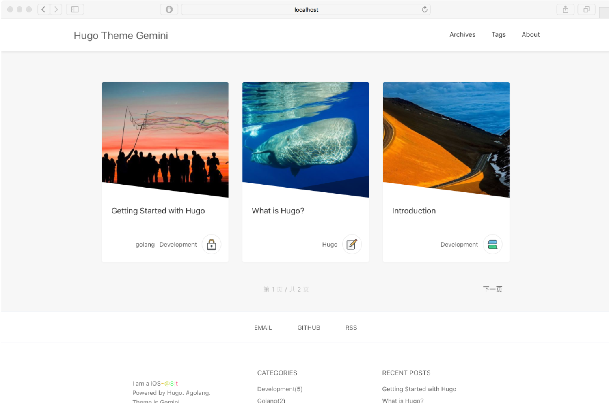

# Gemini theme for hugo

Gemini is a clear and responsive theme for [hugo](http://gohugo.io/). Ported from [Pinghsu Theme](https://github.com/chakhsu/pinghsu), a Typecho theme.

[Demo](https://mjyi.github.io/Gemini/)



## Description

This project comes from [mjyi](https://github.com/mjyi/Gemini), i made the following changes to be able to continued available:

- Supported a new comment sysytem: [gitment](https://github.com/imsun/gitment)
- Fixed some parameters in config.toml

## Installation

```
cd ~/path/themes
git clone https://github.com/howie6879/Gemini
```

## Configuration

**config.toml**
```toml
baseurl = "http://blog.howie6879.cn"
title = "howie6879"
canonifyurls = true
paginate = 6
languageCode = "en-us"
MetaDataFormat = "yaml"
theme = "Gemini"
googleAnalytics = "6MOOsWAEAomrK0SbuyIj5qHKPmawJXdNtiWbB-6DO3U" # Google 统计

[params]
  Keywords = ""
  Author = "howie6879"
  RecentPostCount = 8 
  Favicon = "/images/favicon.png"
  Intro = ["浮浮沉沉","努力就好"]
  SiteComments = false # 评论默认开启 单篇文章中可设置 dis_comments: true 来关闭评论
  
[params.comment]
  owner = "" 
  repo = ""
  client_id = ""
  client_secret = ""

[[params.social]]
  title = "Github"
  url = "https://github.com/howie6879"
  
[[params.social]]
  title = "Email"
  url = "mailto:xiaozizayang@gmail.com"

[[params.social]]
  title = "RSS"
  url = ""

[[menu.main]]
  name = "Archives"
  url = "/post/"
  weight = -200
[[menu.main]]
  name = "Tags"
  url = "/tags/"
  weight = -180
[[menu.main]]
  name = "About"
  url = "/about/"
  weight = -160
```

**Post Detail Configuration**

in archetypes/post.md

```
---
title: 如今的生活—2017
date: 2017-01-29
image = "/images/thumbs/0.jpg" #set a picture, or randomly select one in the folder images/thumbs
categories:
  - 随笔
tags: [随笔]
dis_comments: true
toc = true
author = ""
author_url = ""
draft = true
---
```


